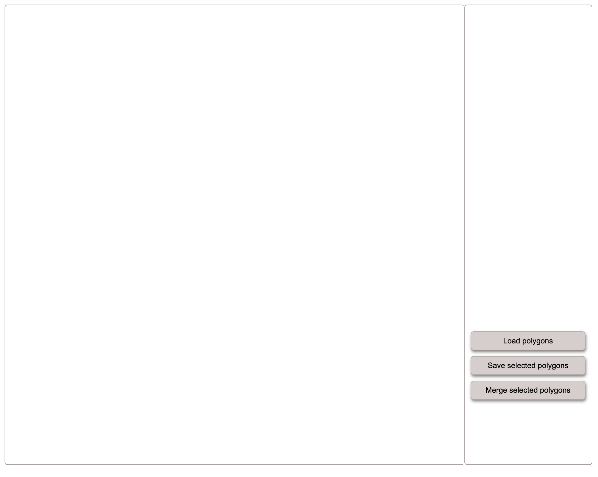
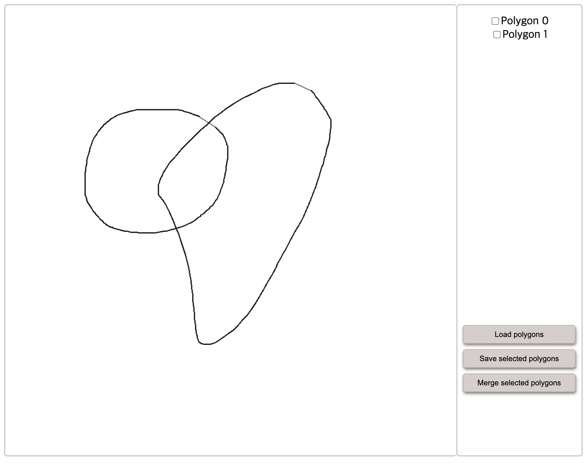
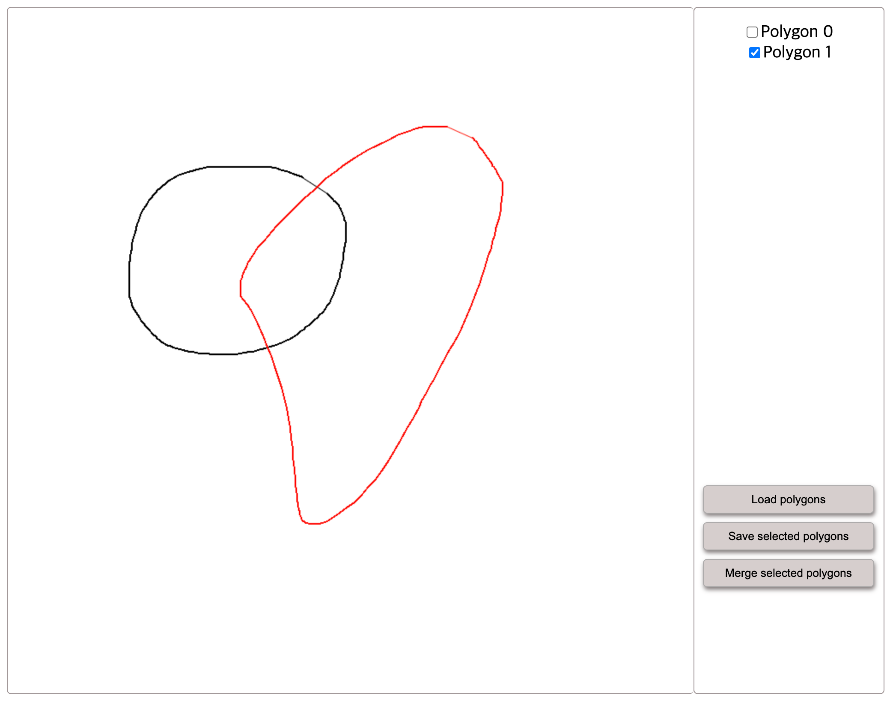
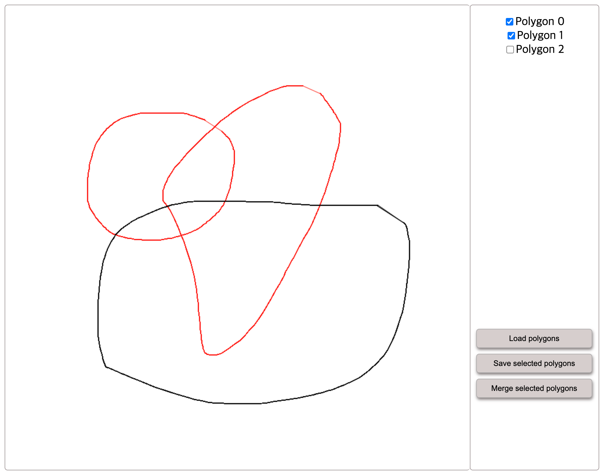
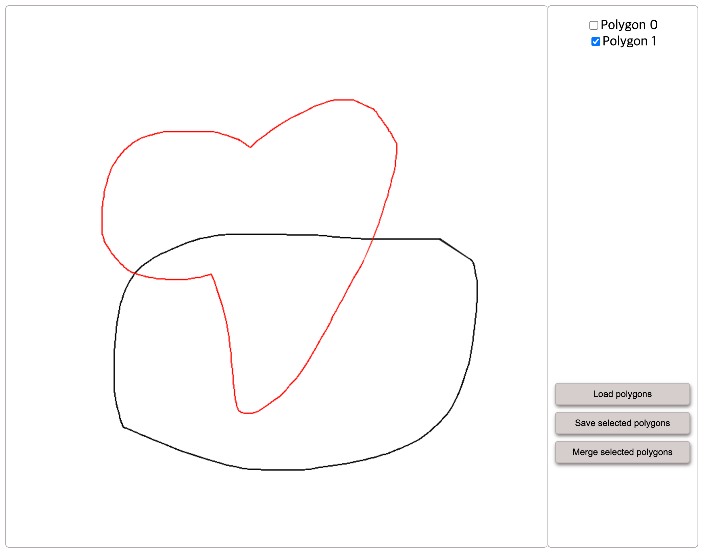

# Lunit AIP Frontend Technical Interview Assignment

In this phase, you will assume that you are a member of a team. Please create a branch and open a pull request (PR) to start development. Your goal is to complete the given feature requirements and submit your commits, comments, and corresponding task descriptions to make your reviewer understand what you did to complete the task through the PR.

## Task goal

### 1. Canvas with polygon list menu
create a web interface consisting of two components;  `<Canvas />`  and `<List />`.

`<Canvas />` should be able to draw a line with a left mouse clicking and dragging.
Once you stop dragging, the start and end points of the line will be connected to generate a polygon. Whenever a new polygon is drawn, it should be listed on the `<List />` component.

Polygons listed in `<List />` can be selected for another functionality mentioned below.

### 2. Load / Save polygons

Your application should be able to load polygons from a serialized file located in the local filesystem and save selected polygons as a file filled with serialized data of polygons.

You can freely choose any serialization/deserialization strategy for your polygon data, but it would be beneficial to show that your strategy is better than simple ones in terms of efficiency, performance, scalability, etc.

### 3. Merge two polygons

You can select two polygons that have intersected points between each other on the `<List />` component.

It should be able to eliminate the two polygons and draw a new merged polygon like the one below, by clicking the "Merge selected polygons" button.

You can freely use any existing libraries to perform this merging operation, but it would be beneficial if you came up with your algorithm to solve this problem.

## What we’re evaluating

- The technologies we currently use include **Typescript, React, Jest, Cypress, and Material UI**. We'd recommend using relevant tech stack as the primary tool for development since they align closely with our team's needs. However, this isn't mandatory. If you're more proficient in a different tool, feel free to use it and showcase why it's more beneficial for development.
- It isn't necessary to match the component style like the above screenshot images. Feel free to design your application as you want to.
- Please commit all your code to GitHub. Our engineers will read your code. **You are highly encouraged to use third-party packages.**
- Being able to complete the features on time is appreciable, but it is not the only standard for success. We also value the details in the development process, such as thinking logic, code structure, and test coverage. Therefore, if you encounter any difficulties, please explain your thoughts through the PR. Thank you for taking the time to participate in the interview. We look forward to seeing your results.

### Required
- Does it work properly?
- How well is your application architecture organized?
- How clean is the code?

### Advanced(Not required, but plus.)

- Write test cases and provide clear instructions for executing them.
- Share a preview deployment link that allows reviewers to test the feature on a desktop Chrome browser.
- Deliver a well-structured pull request that clearly explains the implemented feature.

## Due date

This assignment is expected to be completed within 3 days. If you currently have a full-time job, we expect it to be completed within 1 week. The task is expected to take about 12-18 hours, so please reply to HR your start date and Github ID based on your own situation and complete the task within the given time. In principle, we do not expect it to be completed beyond the due date. Please take your time and show us how is your best work.
